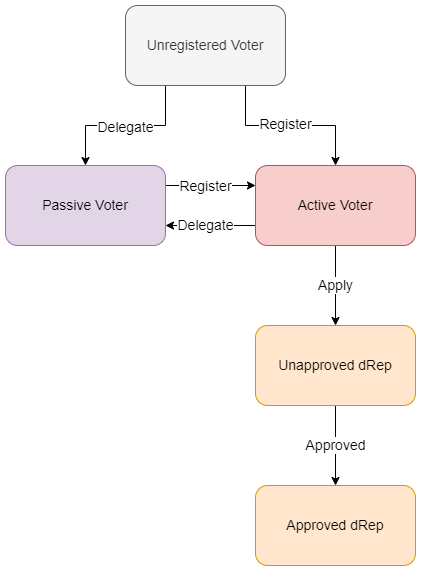
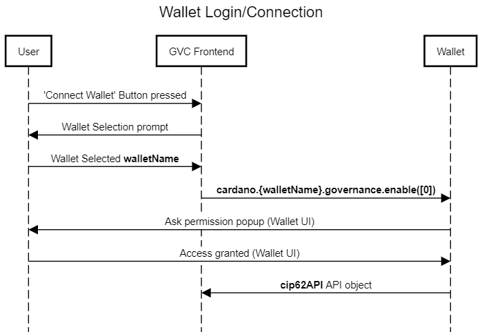
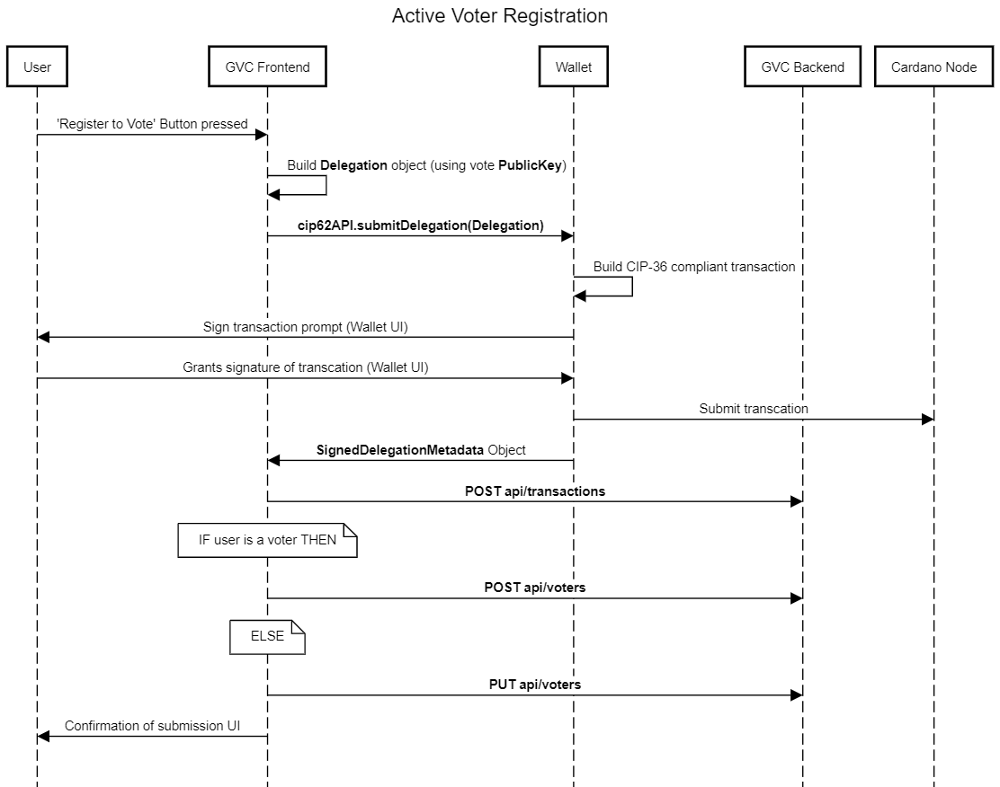
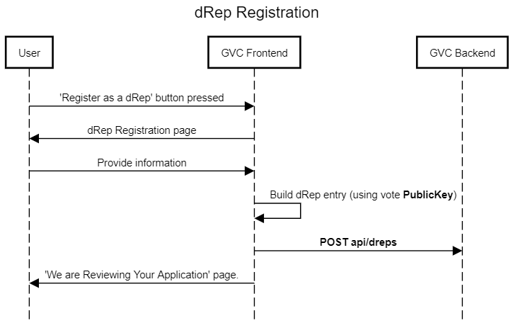
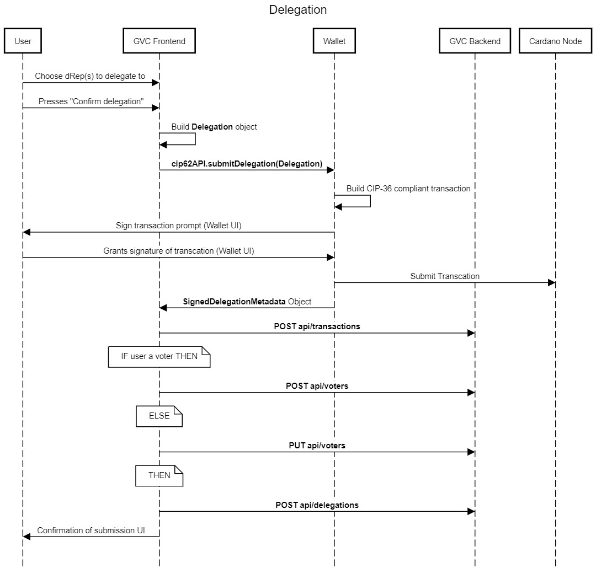
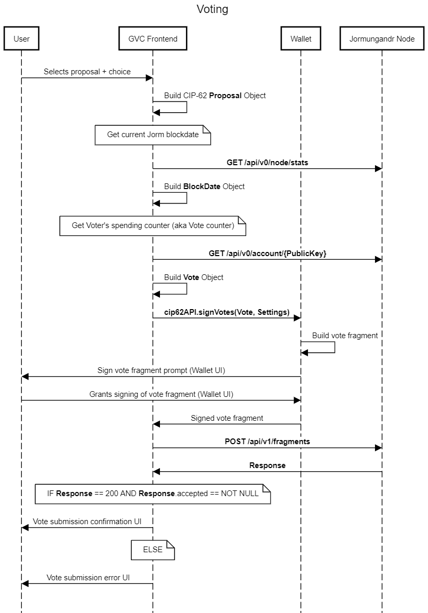
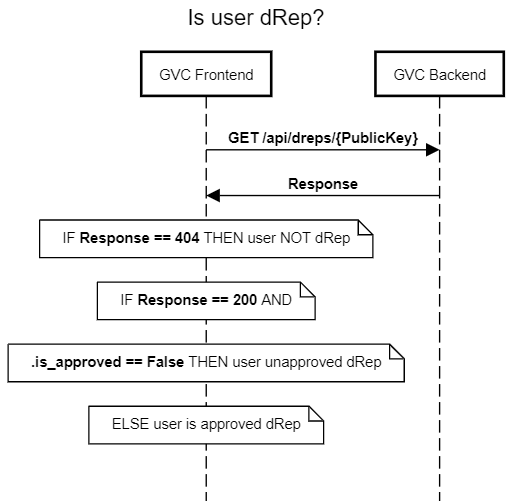
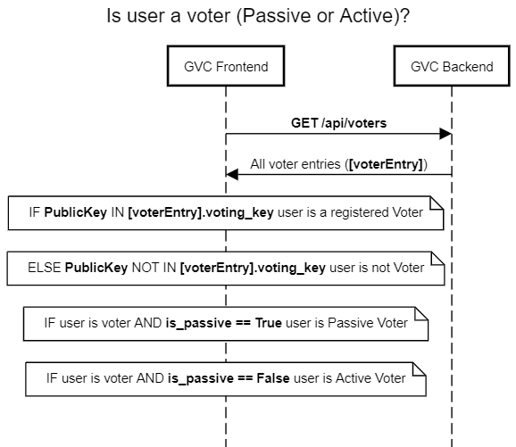
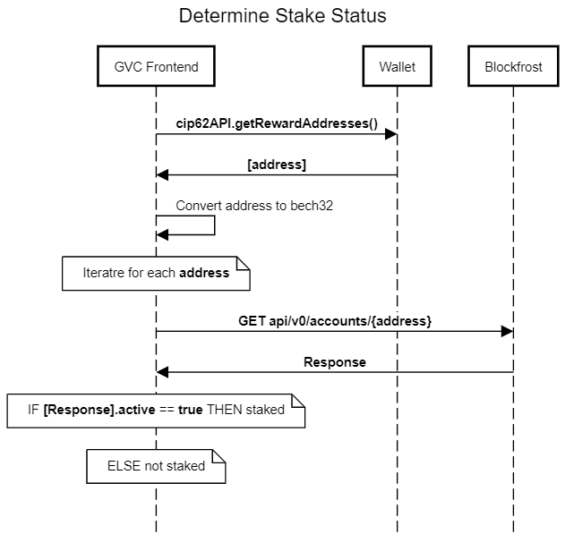

## Voting Center

### Introduction

The Governance Voting Center (GVC) dApp allows users to interact with Cardano's Project Catalyst. Offering users the ability to register to vote, delegate voting rights and or sign up to be a Catalyst dRep. This aims to succeed the current Catalyst Voting App platform.

### Background - Project Catalyst

Here I will outline the landscape in which GVC is situated.

Project Catalyst is a community-driven governance platform developed on top of Cardano. It is designed to allow the community to propose challenges and then vote on the allocation of funding to projects which address these challenges.

The goal of Project Catalyst is to allow the Cardano community to have a say in the direction of the Cardano eco-system and to encourage participation and collaboration within the community. It is intended to be a transparent and democratic process for making decisions about the future of Cardano.

The Project Catalyst process involves three phases: innovation, governance, and execution. The innovation phase includes several stages, including ideation (sharing insights and collaborating on ideas), submitting proposals, refining proposals, finalizing proposals, and assessing proposals. The governance phase includes registration (adding proposals to the voting system and inviting voters to register), voting (casting votes for proposals), vote tallying (determining which proposals will receive funding based on the votes), and rewarding (distributing funding to approved proposals). The execution phase includes reporting (providing regular progress updates on funded projects). Overall, these phases and stages are designed to ensure that the best ideas are selected and implemented effectively within the framework of the challenge set by the fund, and to ensure transparency and accountability throughout the process.

Participation during the innovation phase takes place primarily on [Catalyst's Ideascale website](https://cardano.ideascale.com/). Moving to [Catalyst Voting App](https://apps.apple.com/gb/app/catalyst-voting/id1517473397) to engage with the governance phase, submitting votes to the [Vote Storage Ledger](https://input-output-hk.github.io/catalyst-core/core-ledger-doc/introduction.html) Jormungandr.

To engage with the Catalyst Voting App users have to first link their Cardano wallet and share secret Voting Key material via a QR code, see [guide](https://iohk.zendesk.com/hc/en-us/articles/900005679386-Catalyst-registration-and-voting-guide). GVC aims to offer an alternative to this flow by allowing Cardano wallets to connect directly with a dApp.

#### Open Catalyst APIs

Catalyst offers hosted http REST APIs providing information on fund/challenge/proposal state, voter key metrics and Jormungandr state data. These are known as open Gov APIs, specifications can be seen:
- [VIT Servicing Station API](https://input-output-hk.github.io/catalyst-core/api/vit-servicing-station-v0.html)
- [Voting Ledger API v0](https://input-output-hk.github.io/catalyst-core/api/vote-ledger-v0.html)
- [Voting Ledger API v1](https://input-output-hk.github.io/catalyst-core/api/vote-ledger-v1.html)

Adding to this offering is the [GVC API](../voting-center-backend/src/api/), offering data on approved dRep profiles.

#### Catalyst Standards

##### **Voter Registration**

To register one's intent to vote in Project Catalyst the user must first register their voting key on Cardano mainnet, in a transaction which conforms to the [CIP-36](https://github.com/cardano-foundation/CIPs/tree/master/CIP-0036) standard. By registering this onchain they are creating an association between their Staked ADA (voting rights) and their voting key. This transaction can then be viewed by Catalyst's tooling to assign said voting key its voting power to be excreted during voting.

The CIP-36 standard is an updated version of the [CIP-15](https://github.com/cardano-foundation/CIPs/tree/master/CIP-0015) standard, allowing for further features such as registration of multiple voting keys at once. GVC UI allows users to specify dRep voting keys in this transaction, this is known as delegation. This creates an onchain association between the user's Staked ADA and the dRep's voting keys.

Onchain the difference between registration and delegation is not noticeable, as the CIP-36 standard does make ownership of the voting keys known, only the stake key. Meaning that the holder of the stake key must be one to submit the transaction, but the standard does not imply ownership of the voting key(s) included. 

Registration and delegation transactions must follow the standards specified for each Catalyst Funding round. With GVC utilizing CIP-62 to generate transactions conforming to the CIP-36 standard.

##### **dApp Connector**

GVC utilizes a webpage-based communication bridge, which allows webpages (i.e. dApps) to interface with Cardano wallets. Cardano, currently, has one standard for this CIP-30 with one extension CIP-62. 

CIP-62 is a governance orientated extension to the base CIP-30 specification. This adds functionality for wallets to pass voting keys to dApps, for dApps to pass the information required for wallets to create and submit CIP-36 transactions and for wallets to sign generic governance votes.

Cardano wallets have to implement functionality that conforms to the CIP-62 standard for GVC Frontend to be able to interact.

#### Definitions

| Term      | Definition | Pseudonym(s) |
| --------- | ---------- | ------------ |
| Active Voter | A user who intends to vote with their own voting power. They have associated their Staked ADA with their voting key in a CIP-36 transaction. | |
| (Vote) Registration | The act of associating one's staked ADA with their voting key. This makes them an active voter. | Self-delegation, active voter registration |
| (approved) dRep | An active voter who has applied to be a Catalyst dRep and been approved, allowing their profile to be shown in GVC to prospective passive voters. | Catalyst dRep or just dRep |
| Unapproved dRep | An active voter who has applied to become a dRep but is not approved. | |
| Passive Voter | Someone who does not want to vote for themselves, so they have associated their Staked ADA (voting power) with a dRep's voting key. | |
| (vote) delegation | The act of associating one's Staked ADA with a voting key controlled by another entity, within a CIP-36 compliant transaction. This makes the entity a passive voter. | |
| Proxy Voter | This is someone who has delegated their voting power another entity who is not a dRep. This feature is not support by GVC. | |
| Partial Delegation | When someone delegates part of their voting power to their own voting key and some to voting key(s) they don't control. This is not supported in the GVC. | |
| Snapshot | This is the act of look at the chain for X point in time and for that point calculating the total voting power of each voting key. | |
| Jormungandr | The current voting ledger used by Catalyst, it is it's own blockchain. | |
| Voting Power | A voting key's voting power is equal to the amount of Staked ADA associated with it through CIP-36 transactions. This power can then be excreted on Jormungandr at voting time. | Voting rights |
| Vote Fragment | This is a singular vote on a proposal, currently GVC packages one vote fragment into one Vote Transaction to be submitted to Jormungandr. | |
| Voter Metrics | This is the associated metadata for a given Voting key. For example, how much voting power is associated with a voting key. These can be queried from VIT-SS. | Voting key metrics |
| Delegator Metrics | This is the associated metadata for a given Stake Key. For example, which voting keys has the stake key delegated to. | |

### GVC Architecture

GVC is built using an REST API driven Node/Express backend, React frontend with Strapi CMS attached to a PostGres database. These components combine to offer users a new ways to interact with Catalyst.

This design was chosen to enable GVC Backend to fit in with the open Catalyst APIs. This means that the community is able to build their own Voting Centers utilizing GVC Backend and the other Catalyst APIs.

Within GVC users are able to:
- Connect their Cardano wallet to GVC via web browser (dApp experience)
- Browse details about the current Catalyst Fund
- Register as an active voter
- Register as a Catalyst dRep
- Delegate one's voting power to a Catalyst dRep
- Vote on proposals
- View voter metrics (Voting power etx)

#### User Groups

GVC caters for four distinct groups of user; active voter, passive voter, dRep and unregistered voter. With each type of user experiencing GVC differently.

#### Frontend

GVC Frontend is a simple API driven React-based application, which has four direct relationships it interacts with. For simplicity in these docs we do not detail the inner architecture of the React application.

Relationships:
- `Jormungandr Node`: GVC Frontend communicates to an instance of a Jormungandr Node via the [Voting Ledger API](#open-catalyst-apis)s. [v0 API](https://input-output-hk.github.io/catalyst-core/api/vote-ledger-v0.html) is used get information on the state of the Jormungandr blockchain, for example to query the spending counter of a given account (voting key). [v1 API](https://input-output-hk.github.io/catalyst-core/api/vote-ledger-v1.html) is used to submit votes and check the status of vote fragments.
- `VIT Servicing Station`: GVC Frontend uses the [VIT REST API](https://input-output-hk.github.io/catalyst-core/api/vit-servicing-station-v0.html) to query information from an instance of VIT servicing station. Here, two categories of data are queried; fund data such as proposal and challenge information, voter metrics such as a voting key's voting power or stake key's delegations.
- `Cardano Wallet`: GVC FE connects to Cardano wallets via injecting a Javascript object which conforms to the [CIP-62]() standard. This connection is frequently utilized for the wallet to enable all key GVC functionality: signature and submission of [CIP-36]() transactions, sharing of voting key and signature of votes. Additionally, this connection offers the full CIP-30 specification, although GVC FE only utilizes the endpoint to view the wallet's balance. 
- `GVC Backend`: GVC FE is closely integrated with the GVC Backend, interfacing with the database making use of the full [GVC REST API](). Examples of this include fetching voter information and storing transaction information.

#### Backend

GVC Backend consists of two containers:
- `HTTP server`: This is a simple server which controls and routes access to the GVC database. Interacting with clients such as the FE and VIT-SS. This container also utilizes the Blockfrost API to update the database on the status of transactions.
- `GVC Database`: This database is used to store information of voters, dReps, transactions sent from GVC FE.

Relationships:
- `VIT Servicing Station`: This acts as a client to the GVC BE to get information on dRep profiles, notably what are dReps voting keys.
- `Blockfrost`: Blockfrost's API is used to update the database on the status of transactions.

##### **HTTP Server**

Inside the HTTP Server container we can see its components. Here we can see the different routes used by the expressAPI component to satisfy API calls. All but `cbor-decode` and `blockfrost` route to the database; `cbor-decode` is used by the frontend to decode CBOR encoded data, `blockfrost` is used to query Blockfrost API.

### Technical Design

Here I will outline specific implementation details for how each feature have been achieved.

This is a less fleshed out version of [GVC Technical Design](https://docs.google.com/document/d/1Ce6kOE5yl2VhyJRN87ZH8OwfOLs9XP8cJcsjZfZjUoE/edit#).

#### Wallet Connection

We equate connecting a wallet to GVC as logging into GVC. GVC uses the CIP-62 standard to connect to and communicate with Cardano wallets. This process involves a user granting GVC access to their wallet’s CIP-62 API. Since CIP-62 is an extension to CIP-30, access to CIP-62 API implicitly enables access to the CIP-30 API.

#### Register to Vote

This is where a user publishes on-chain that they want to actively vote for proposals themselves. This CIP-36 compliant transaction associates their staked ADA (aka their voting power) to their voting key. So at time of vote they can vote with the voting power associated with their stake

#### dRep Registration

dRep registration is very important because GVC acts as a source of truth for dReps. There is no other way to look up details on dReps other than our very own GVC.

#### Delegation

The act of delegation is associating YOUR staked ADA with someone else’s voting key (for GVC the someone else is always dReps). This transfers the voting power associated with YOUR staked ADA to the other person’s voting key. 

On the level of the blockchain, this transaction follows the CIP-36 specification. The metadata in the transaction contains the voting key(s) you’re delegating to and your staking key.

GVC Backend represents delegations in a particular way (a cool way). Each entry in the delegations table represents one mapping from a voter and a dRep, with associated weight. This means that more than one entry in the delegations table can be present in one transaction. This is because you can delegate to more than one dRep in one transaction. So say you delegate 25% of your voting power to dRep1 and 75% to dRep2, this will be represented by two entries in the delegations table. These two entries will share the same transaction_hash.

#### Voting

TODO: ONCE FINALIZED

#### Show Voter Metrics

TODO: ONCE FINALIZED

#### Show Proposals

TODO: ONCE FINALIZED

#### Determine Voter Group

Here I want to outline a general method to determine the voter group/status of the user. These methods could be used in different areas of the Frontend implementation. The methods  use a wallet’s Voting Key to act as a proxy for identity, using this to look up further information on the user from the GVC Backend.

Below I will describe a few examples of where this could be useful. These assume that a wallet is already connected.

Examples (there are definitely more):
- Check if the connected wallet/user is an approved dRep.
    - We need to know this to be able to show the correct wallet dashboard. 
    - This is needed so we know who has already applied to be a dRep and thus we will not allow them to apply again.
- Check if the connected wallet/user is an unapproved dRep (aka an active voter who has applied to be a dRep).
    - We need to know this to be able to show the correct wallet dashboard (active voter dashboard).
    - This is needed so we know who has already applied to be a dRep and thus we will not allow them to apply again.
- Check if the connected wallet/user has registered as an active voter.
    - We need to know this to be able to show the correct dashboard. 
    - We need to know this to offer appropriate actions if the user attempts to become a dRep.
Need to show appropriate warning that they lose their right to vote if they attempt to delegate.
- Check if the connected wallet/user is an passive voter:
    - We need to know this to be able to show the correct dashboard (delegation dashboard). 
    - This is needed so we can show which dReps they have delegated to.
    - Need to show appropriate warning that they will have to vote if they try to register as an active voter.

#### Transaction Verification

TODO: ONCE FINALIZED

#### Determine Stake Status

