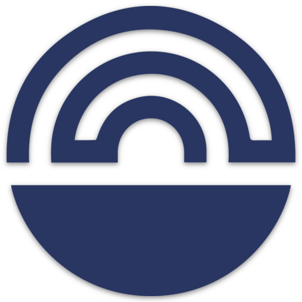

# Catalyst Voting Center - Frontend

Welcome to the official repository for the Catalyst Voting Center.

## Table of content:

- [Catalyst Voting Center - Frontend](#catalyst-voting-center---frontend)
  - [Table of content:](#table-of-content)
  - [Prerequisites](#prerequisites)
  - [Installation](#installation)
  - [Building the project](#building-the-project)
  - [Dockerization](#dockerization)
      - [Prerequisites](#prerequisites-1)
      - [Running the application](#running-the-application)
      - [Configuration](#configuration)
  - [Environment variables](#environment-variables)
    - [Example of environment variables](#example-of-environment-variables)
  - [Running the application locally](#running-the-application-locally)
  - [Connecting a wallet](#connecting-a-wallet)

## Prerequisites

Before starting, please ensure you have the following:

1. Node.js and npm - You can download them from [here](https://nodejs.org/en/download/).
2. Nufi or Eternl wallet extension - These can be installed from their respective websites or browser extension stores.

## Installation

To get started with the project, clone this repository to your local machine.
Navigate into the project's root directory in your terminal and run the following command to install all necessary dependencies:

```sh
npm install
```

## Building the project

To build the project, run the following command:

```sh
npm run build
```

This will initiate the build process. The script builds the application in production mode, optimizes it for the best performance,
and outputs the build files into the build folder. The build is minified and the filenames include hashes.

## Dockerization

[Docker](https://docs.docker.com/get-started/) provides an open platform for developing, shipping,
and running applications, enabling you to separate your applications from your infrastructure to deliver software rapidly.

#### Prerequisites

Ensure Docker is installed on your machine. If not, you can find the installation guide [here](https://docs.docker.com/get-docker/).

#### Running the application

The Catalyst Voting Center application can be run in Docker containers for both the frontend and backend. This can be achieved with a single command:

```sh
docker compose up
```

This command will simultaneously start both frontend and backend services as defined in the Docker Compose configuration.

#### Configuration

The Docker Compose configuration can be found in the
[`docker-compose.yaml`](../docker-compose.yaml) file.

The Docker configuration for the individual services is defined in their respective Dockerfiles.
You can find the Dockerfile for this service [here](./Dockerfile). Adjustments to the Docker configurations can be made in these files.

## Environment variables

These are the important environment variables that are required for the project to run properly:

```sh
FAST_REFRESH=false
REACT_APP_BASE_URL={backend_url}
REACT_APP_CATALYST_CORE_API_URL={catalyst_core_api_url}
REACT_APP_AUTH_TOKEN={backend_full_access_token}
REACT_APP_SHARETHIS_PROPERTY_ID = {your_sharethis_(https://sharethis.com/)_id} // optional for development
REACT_APP_SENTRY_DSN = {your_sentry_dsn} // optional for development
REACT_APP_CARDANOSCAN_BASE_URL = {cardanoscan_url}
REACT_APP_FRONTEND_URL = {frontend_url}
```

### Example of environment variables

```sh
FAST_REFRESH=false
REACT_APP_BASE_URL = http://localhost:1337
REACT_APP_CATALYST_CORE_API_URL = https://api.dev.projectcatalyst.io/
REACT_APP_AUTH_TOKEN = 000e721ab4e32917c33c1228888e986c903b936106944a22009cf6f3e685c1a138cc7ea01568902bb3105c42d4aab2cfeae4bdd1f61c864610f298f32d1ccf5bebc343fd932cd2332657973ef60d51f61d7d14c5beb42117924d562e3d62df88e4e48ad3b0b9df402733423988d66d54f77cb9ad60b36e12a14ab9610e9386b1
REACT_APP_SHARETHIS_PROPERTY_ID = 111112222333334444455555
REACT_APP_CARDANOSCAN_BASE_URL = "https://preprod.cardanoscan.io/"
REACT_APP_FRONTEND_URL = http://localhost:3000
```

## Running the application locally

To start the application in your local environment, run:

```sh
npm start
```

This command starts the application in development mode. Open http://localhost:3000 to view it in your browser.

## Connecting a wallet

After the application has been opened, you will be prompted to connect your Nufi or Eternl wallet.
Please ensure you've already installed the corresponding wallet extension in your browser.
